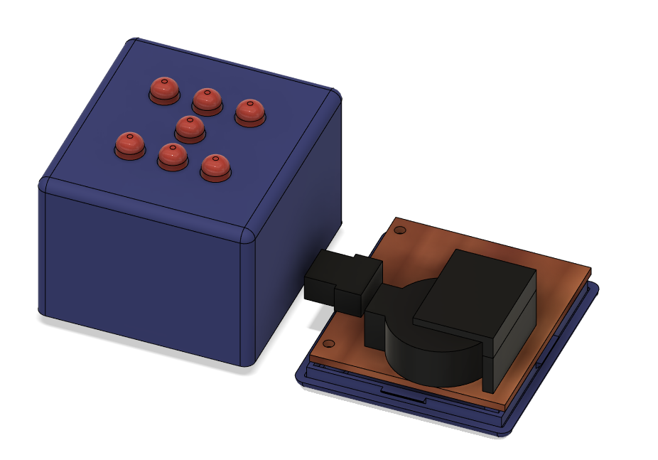

# LED Roll Dice
### Attiny85 with Shiftregister and Accelerometer
#### Parts
* **74HC595** Shiftregister
* 7 **Red LEDs**
* Coin Cell Battery + Holder
* ADXL345 Accelerometer
#### Schematic

* Minimal I/O Pins required (in total: 4)
* 2 Pin Connection to Shiftregister (CLK and DATA to **Attiny85** + LATCH connected to DATA)
* Accelerometer for Shake Detection
* "Shuffle" Animation
* LEDs logically connected in Pairs
#### 3D Printed Case
